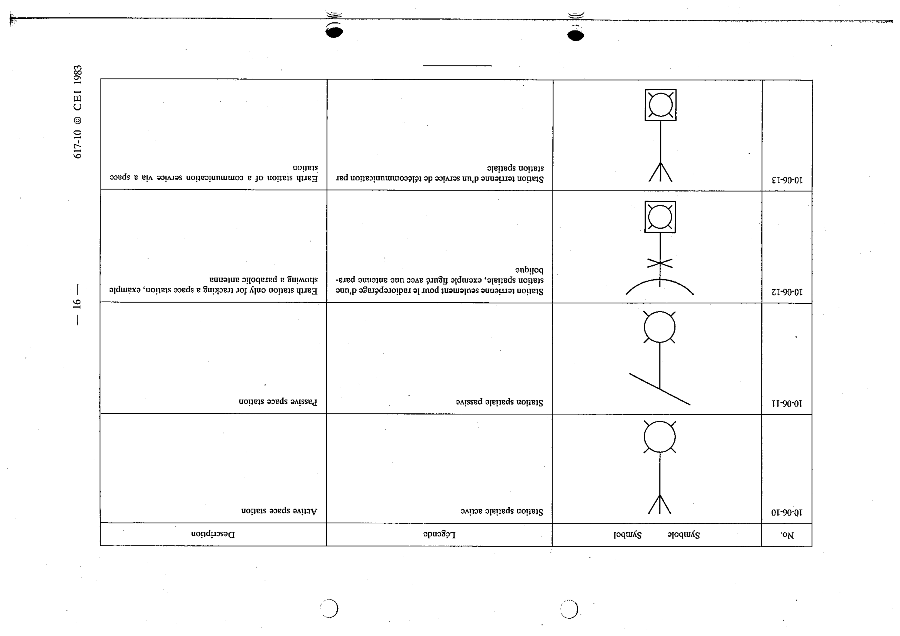

# 10-06-11 — Passive space station

This symbol appears on Publication No.617-10.pdf, printed p.16 (full page shown).

**Standard:** [[60617-10]] · **Section:** [[60617-10-06-radio-stations]]

## Description
Passive space station.

## Names
- **EN:** Passive space station
- **FR:** Station spatiale passive

