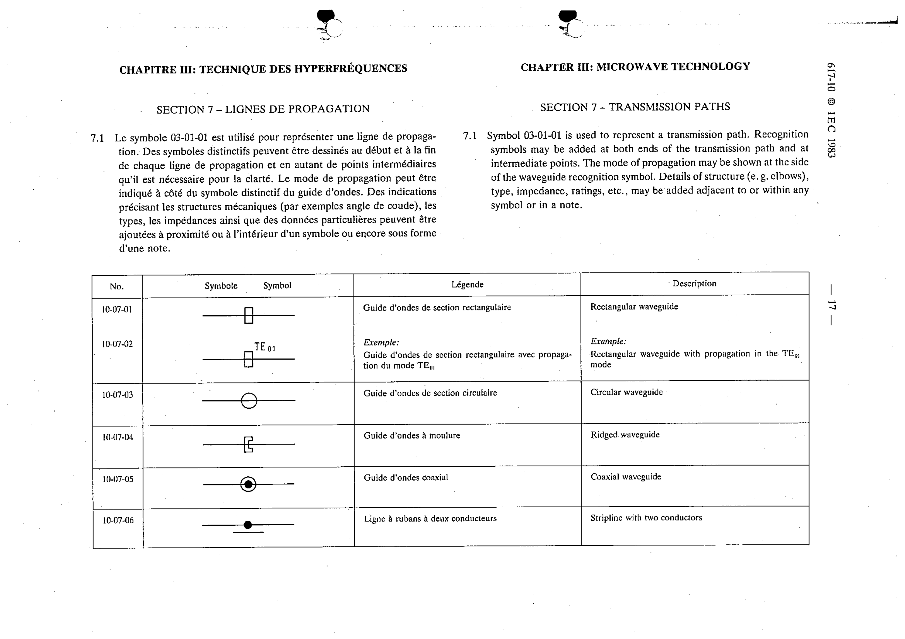

# 10-07-02 — Rectangular waveguide with propagation in the TE01 mode

This symbol appears on Publication No.617-10.pdf, printed p.17 (full page shown).

**Standard:** [[60617-10]] · **Section:** [[60617-10-07-transmission-paths]]

## Description
Rectangular waveguide with propagation in the TE01 mode (example).

## Names
- **EN:** Rectangular waveguide with propagation in the TE01 mode
- **FR:** Guide d'ondes de section rectangulaire avec propagation du mode TE01

