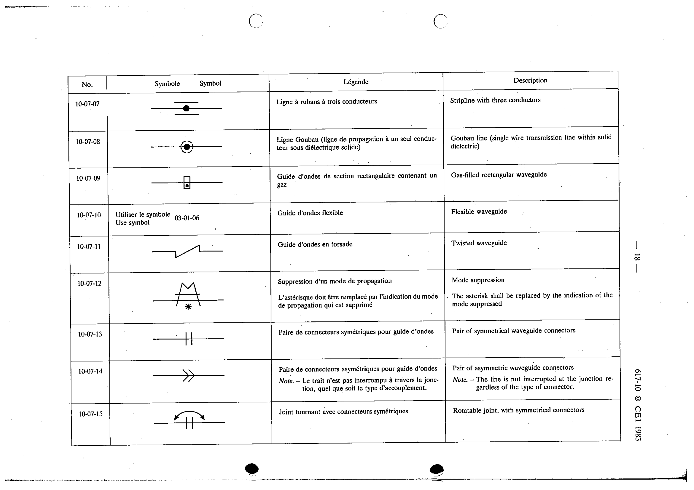

# 10-07-12 — Mode suppression

This symbol appears on Publication No.617-10.pdf, printed p.18 (full page shown).

**Standard:** [[60617-10]] · **Section:** [[60617-10-07-transmission-paths]]

## Description
Mode suppression. The asterisk shall be replaced by the indication of the mode suppressed.

## Names
- **EN:** Mode suppression
- **FR:** Suppression d'un mode de propagation

