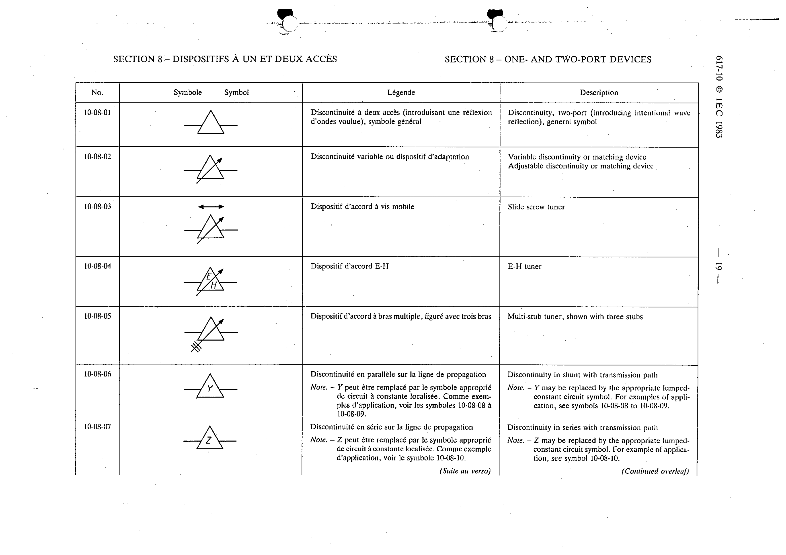

# 10-08-06 — Discontinuity in shunt with transmission path

This symbol appears on Publication No.617-10.pdf, printed p.19 (full page shown).

**Standard:** [[60617-10]] · **Section:** [[60617-10-08-one-and-two-port]]

## Description
Discontinuity in shunt with transmission path. Note. - Y may be replaced by the appropriate lumped-constant circuit symbol. For examples of application, see symbols 10-08-08 to 10-08-09.

## Names
- **EN:** Discontinuity in shunt with transmission path
- **FR:** Discontinuité en parallèle sur la ligne de propagation

## Notes
- Y may be replaced by the appropriate lumped-constant circuit symbol. For examples of application, see symbols 10-08-08 to 10-08-09.

## Related
- [[10-08-08]]
- [[10-08-09]]
