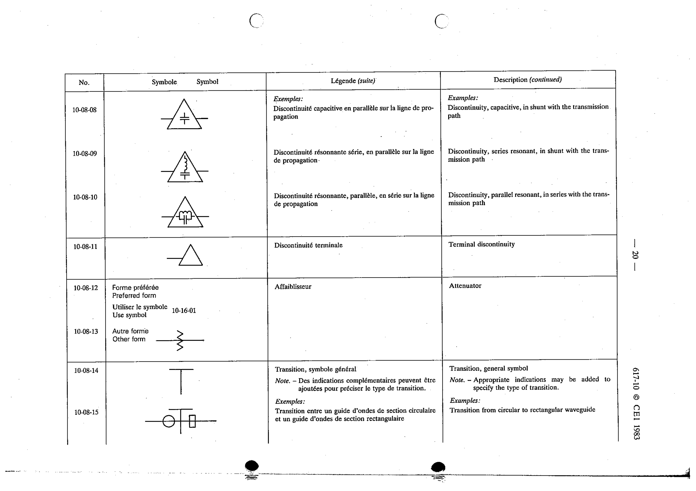

# 10-08-13 — Attenuator (other form)

This symbol appears on Publication No.617-10.pdf, printed p.20 (full page shown).

**Standard:** [[60617-10]] · **Section:** [[60617-10-08-one-and-two-port]] · **other**

## Description
Attenuator. Other form.

## Names
- **EN:** Attenuator (other form)
- **FR:** Affaiblisseur

