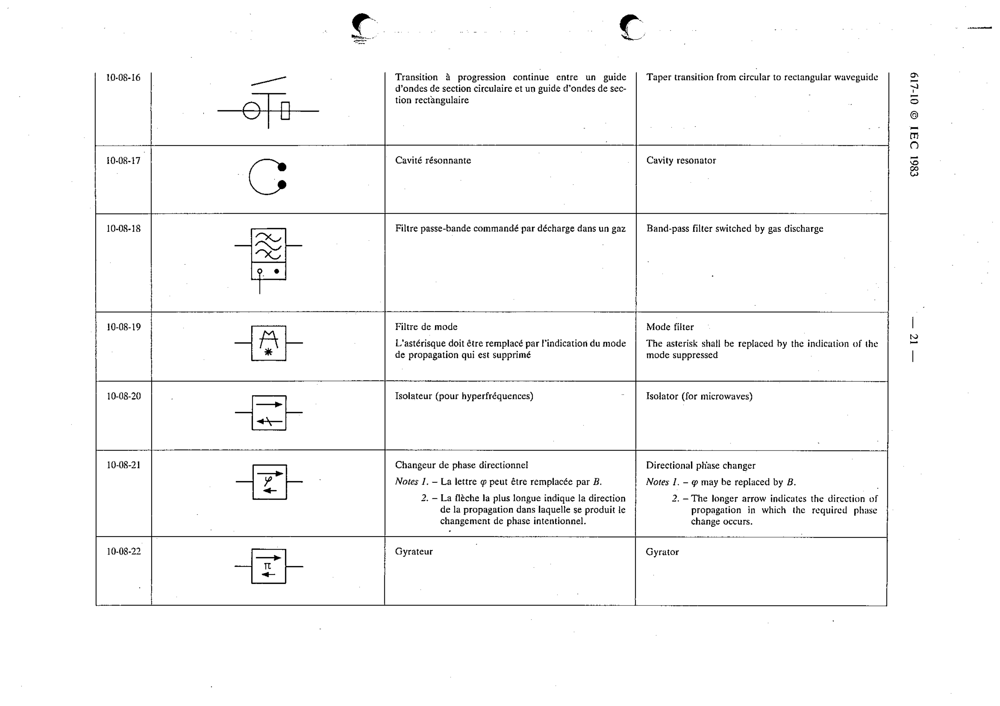

# 10-08-21 — Directional phase changer

This symbol appears on Publication No.617-10.pdf, printed p.21 (full page shown).

**Standard:** [[60617-10]] · **Section:** [[60617-10-08-one-and-two-port]]

## Description
Directional phase changer. Notes 1. - φ may be replaced by B. 2. - The longer arrow indicates the direction of propagation in which the required phase change occurs.

## Names
- **EN:** Directional phase changer
- **FR:** Changeur de phase directionnel

## Notes
- φ may be replaced by B.
- The longer arrow indicates the direction of propagation in which the required phase change occurs.

