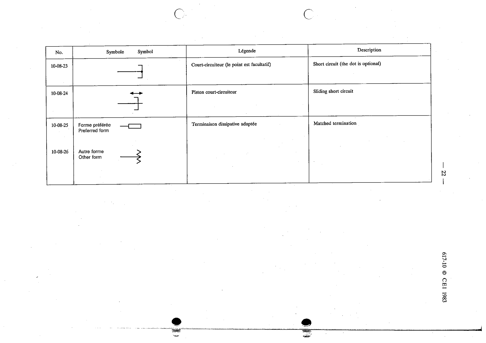

# 10-08-23 — Short circuit (the dot is optional)

This symbol appears on Publication No.617-10.pdf, printed p.22 (full page shown).

**Standard:** [[60617-10]] · **Section:** [[60617-10-08-one-and-two-port]]

## Description
Short circuit (the dot is optional).

## Names
- **EN:** Short circuit (the dot is optional)
- **FR:** Court-circuiteur (le point est facultatif)

