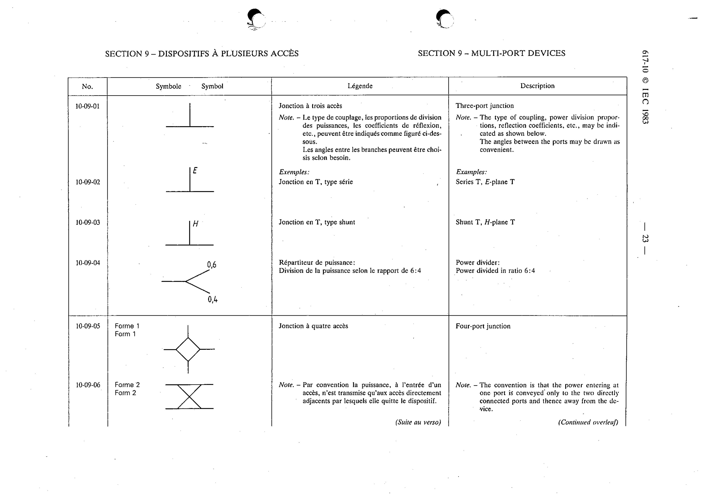

# 10-09-05 — Four-port junction (form 1)

This symbol appears on Publication No.617-10.pdf, printed p.23 (full page shown).

**Standard:** [[60617-10]] · **Section:** [[60617-10-09-multi-port-devices]] · **1**

## Description
Four-port junction. Form 1. Note. - The convention is that the power entering at one port is conveyed only to the two directly connected ports and thence away from the device.

## Names
- **EN:** Four-port junction (form 1)
- **FR:** Jonction à quatre accès

## Notes
- The convention is that the power entering at one port is conveyed only to the two directly connected ports and thence away from the device.

