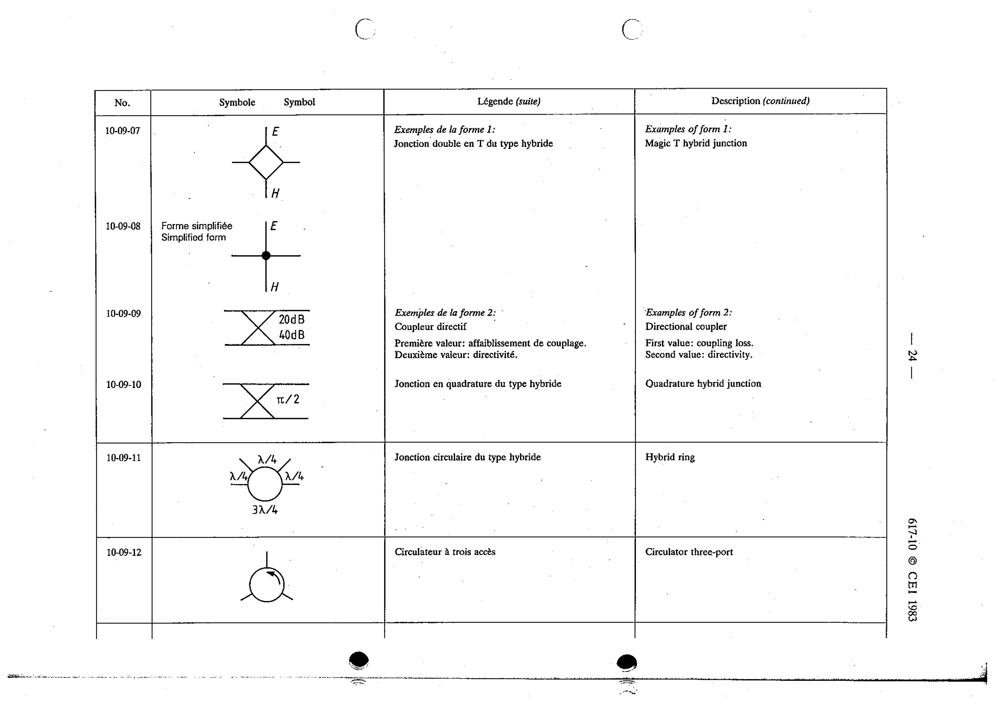

# 10-09-10 — Quadrature hybrid junction

This symbol appears on Publication No.617-10.pdf, printed p.24 (full page shown).

**Standard:** [[60617-10]] · **Section:** [[60617-10-09-multi-port-devices]] · **2**

## Description
Quadrature hybrid junction (example of form 2).

## Names
- **EN:** Quadrature hybrid junction
- **FR:** Jonction en quadrature du type hybride

