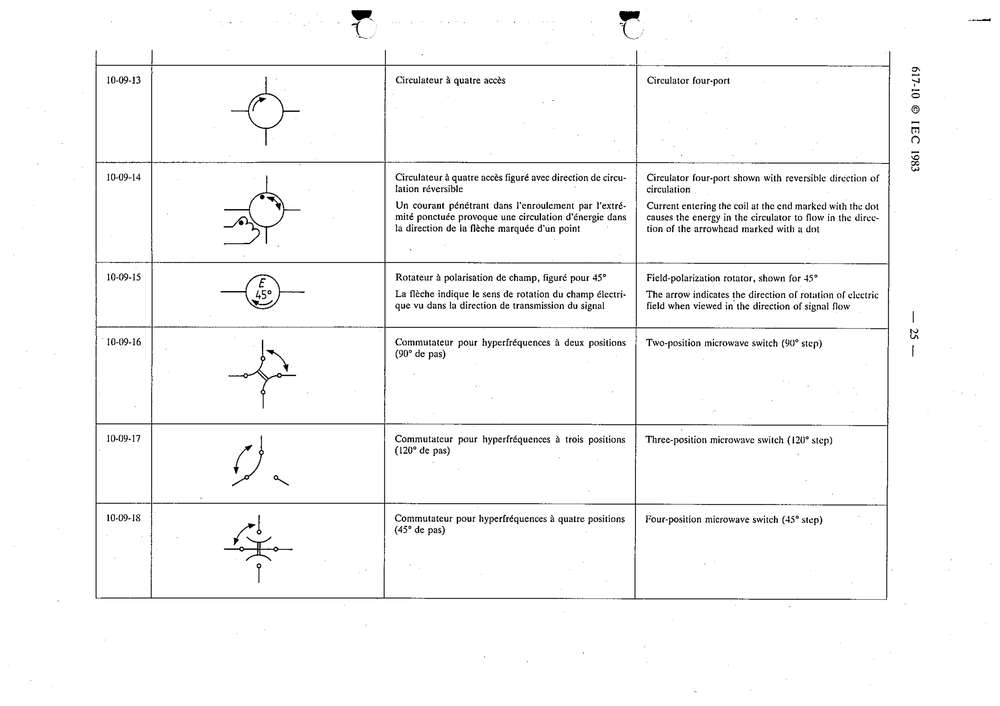

# 10-09-13 — Circulator four-port

This symbol appears on Publication No.617-10.pdf, printed p.25 (full page shown).

**Standard:** [[60617-10]] · **Section:** [[60617-10-09-multi-port-devices]]

## Description
Circulator four-port.

## Names
- **EN:** Circulator four-port
- **FR:** Circulateur à quatre accès

