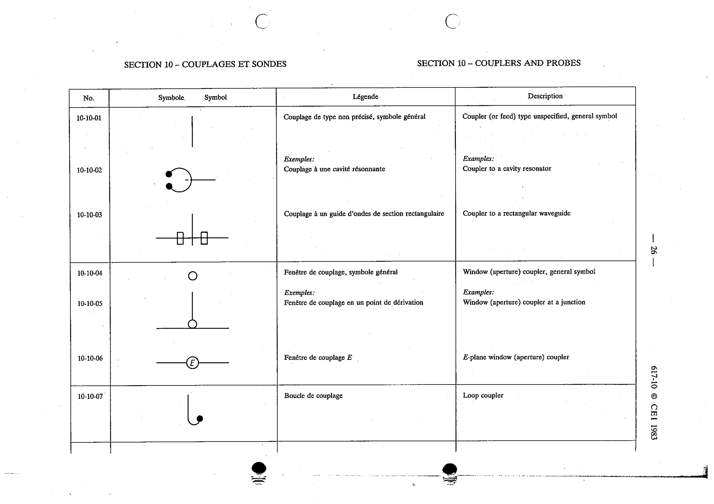

# 10-10-01 — Coupler (or feed), general symbol

This symbol appears on Publication No.617-10.pdf, printed p.26 (full page shown).

**Standard:** [[60617-10]] · **Section:** [[60617-10-10-couplers-and-probes]]

## Description
Coupler (or feed) type unspecified, general symbol.

## Names
- **EN:** Coupler (or feed), general symbol
- **FR:** Couplage de type non précisé, symbole général

