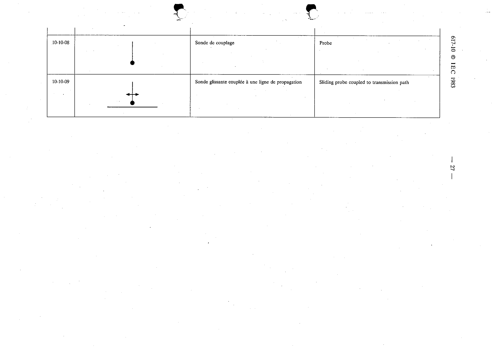

# 10-10-09 — Sliding probe coupled to transmission path

This symbol appears on Publication No.617-10.pdf, printed p.27 (full page shown).

**Standard:** [[60617-10]] · **Section:** [[60617-10-10-couplers-and-probes]]

## Description
Sliding probe coupled to transmission path.

## Names
- **EN:** Sliding probe coupled to transmission path
- **FR:** Sonde glissante couplée à une ligne de propagation

