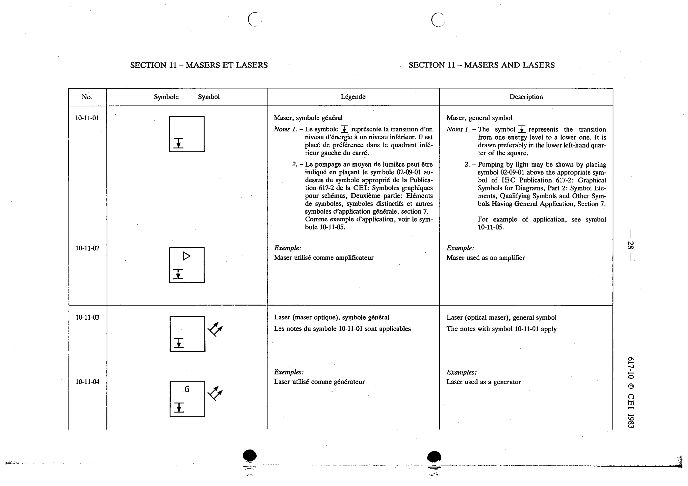

# 10-11-04 — Laser used as a generator

This symbol appears on Publication No.617-10.pdf, printed p.28 (full page shown).

**Standard:** [[60617-10]] · **Section:** [[60617-10-11-masers-and-lasers]]

## Description
Example: Laser used as a generator.

## Names
- **EN:** Laser used as a generator
- **FR:** Laser utilisé comme générateur

