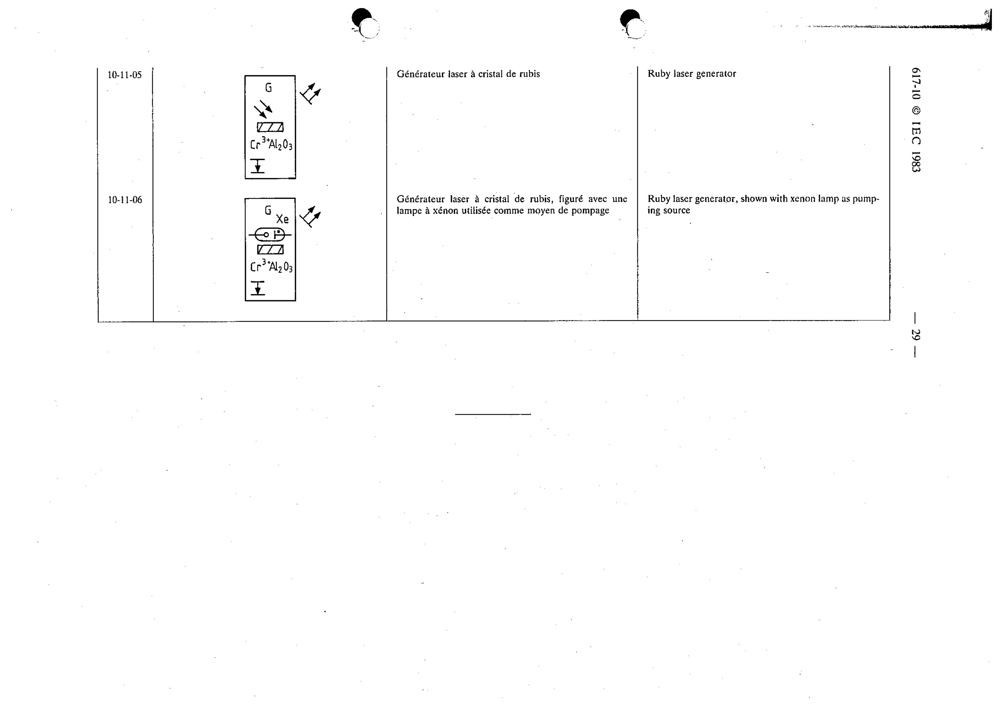

# 10-11-06 — Ruby laser generator, shown with xenon lamp as pumping source

This symbol appears on Publication No.617-10.pdf, printed p.29 (full page shown).

**Standard:** [[60617-10]] · **Section:** [[60617-10-11-masers-and-lasers]]

## Description
Ruby laser generator, shown with xenon lamp as pumping source.

## Names
- **EN:** Ruby laser generator, shown with xenon lamp as pumping source
- **FR:** Générateur laser à cristal de rubis, figuré avec une lampe à xénon utilisée comme moyen de pompage

