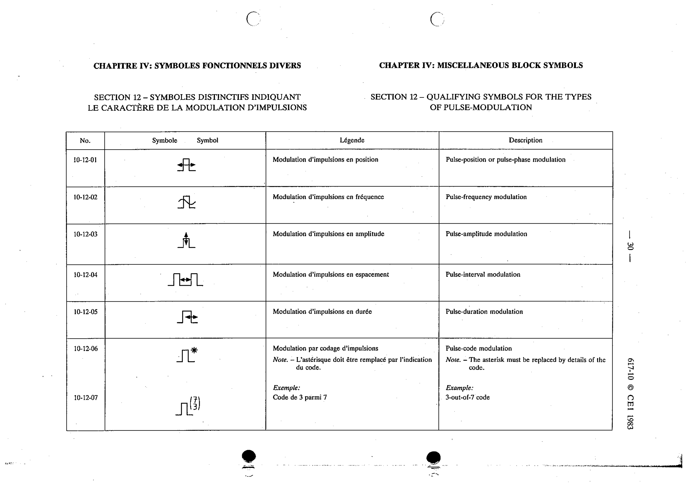

# 10-12-07 — 3-out-of-7 code

This symbol appears on Publication No.617-10.pdf, printed p.30 (full page shown).

**Standard:** [[60617-10]] · **Section:** [[60617-10-12-qualifying-symbols-for-the]]

## Description
Example: 3-out-of-7 code.

## Names
- **EN:** 3-out-of-7 code
- **FR:** Code de 3 parmi 7

