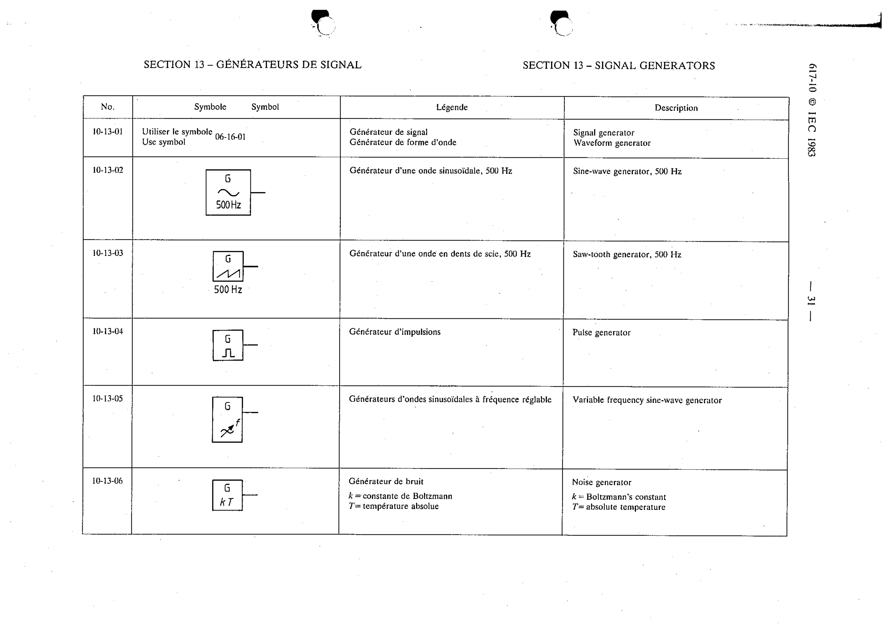

# 10-13-01 — Signal generator / Waveform generator

This symbol appears on Publication No.617-10.pdf, printed p.31 (full page shown).

**Standard:** [[60617-10]] · **Section:** [[60617-10-13-signal-generators]]

## Description
Signal generator. Waveform generator. Use symbol 06-16-01.

## Names
- **EN:** Signal generator / Waveform generator
- **FR:** Générateur de signal / Générateur de forme d'onde

## Notes
- Use symbol 06-16-01.

## Related
- [[06-16-01]]
