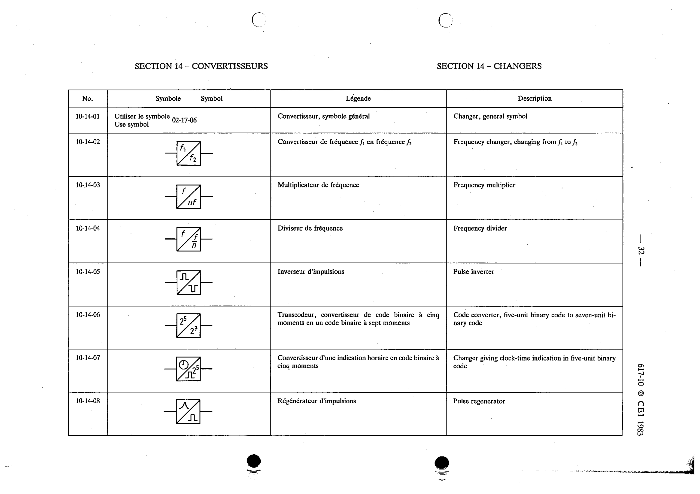

# 10-14-08 — Pulse regenerator

This symbol appears on Publication No.617-10.pdf, printed p.32 (full page shown).

**Standard:** [[60617-10]] · **Section:** [[60617-10-14-changers]]

## Description
Pulse regenerator.

## Names
- **EN:** Pulse regenerator
- **FR:** Régénérateur d'impulsions

