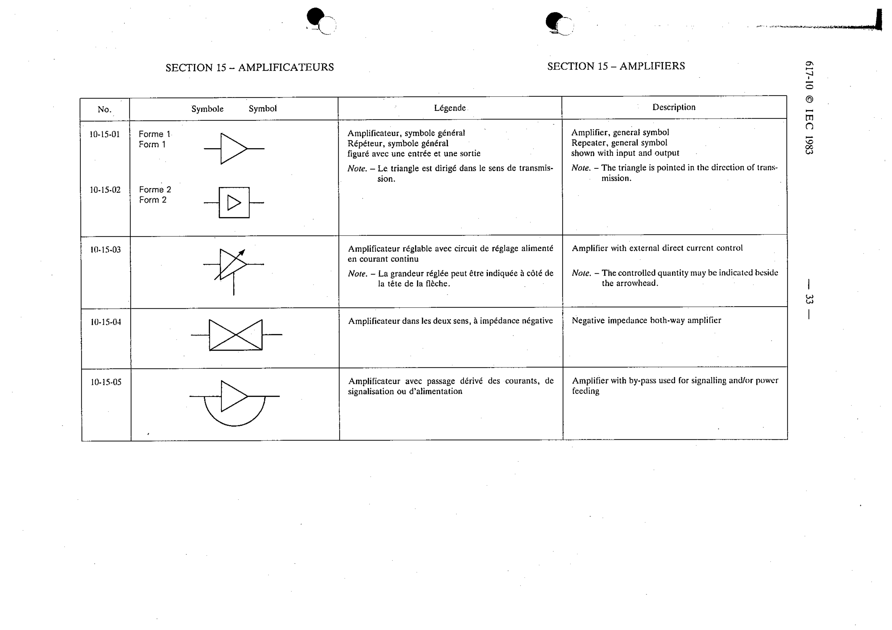

# 10-15-03 — Amplifier with external direct current control

This symbol appears on Publication No.617-10.pdf, printed p.33 (full page shown).

**Standard:** [[60617-10]] · **Section:** [[60617-10-15-amplifiers]]

## Description
Amplifier with external direct current control. Note: The controlled quantity may be indicated beside the arrowhead.

## Names
- **EN:** Amplifier with external direct current control
- **FR:** Amplificateur réglable avec circuit de réglage alimenté en courant continu

## Notes
- The controlled quantity may be indicated beside the arrowhead.

