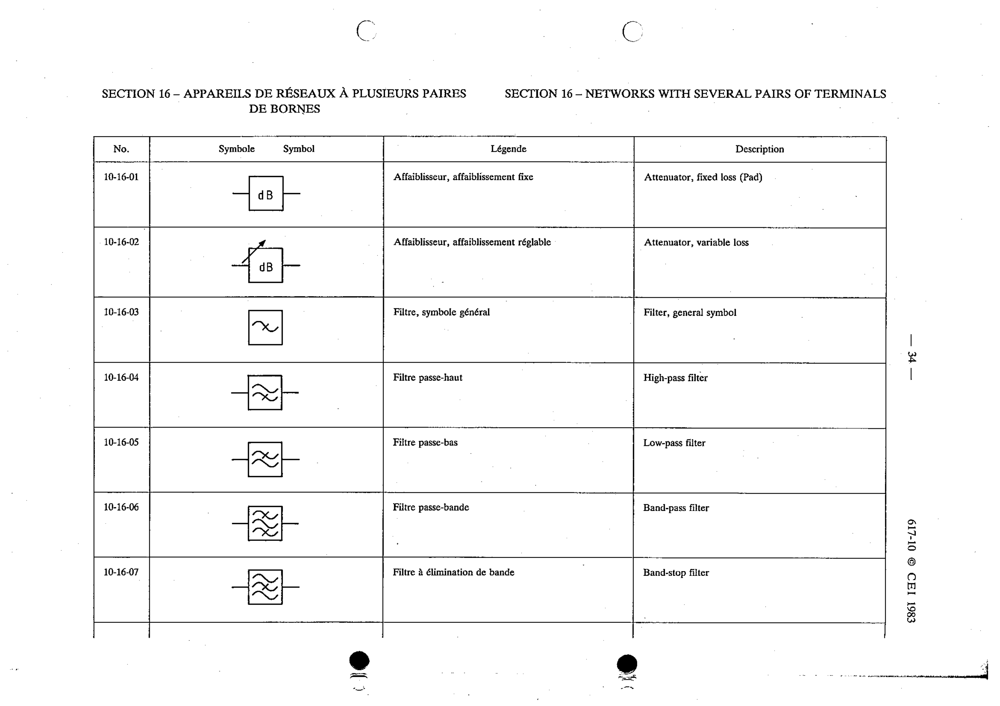

# 10-16-07 — Band-stop filter

This symbol appears on Publication No.617-10.pdf, printed p.34 (full page shown).

**Standard:** [[60617-10]] · **Section:** [[60617-10-16-networks-with-several-pairs]]

## Description
Band-stop filter.

## Names
- **EN:** Band-stop filter
- **FR:** Filtre à élimination de bande

