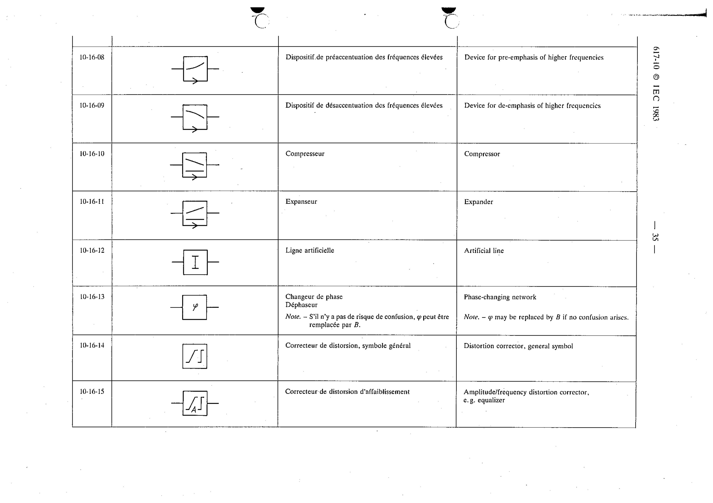

# 10-16-09 — Device for de-emphasis of higher frequencies

This symbol appears on Publication No.617-10.pdf, printed p.35 (full page shown).

**Standard:** [[60617-10]] · **Section:** [[60617-10-16-networks-with-several-pairs]]

## Description
Device for de-emphasis of higher frequencies.

## Names
- **EN:** Device for de-emphasis of higher frequencies
- **FR:** Dispositif de désaccentuation des fréquences élevées

