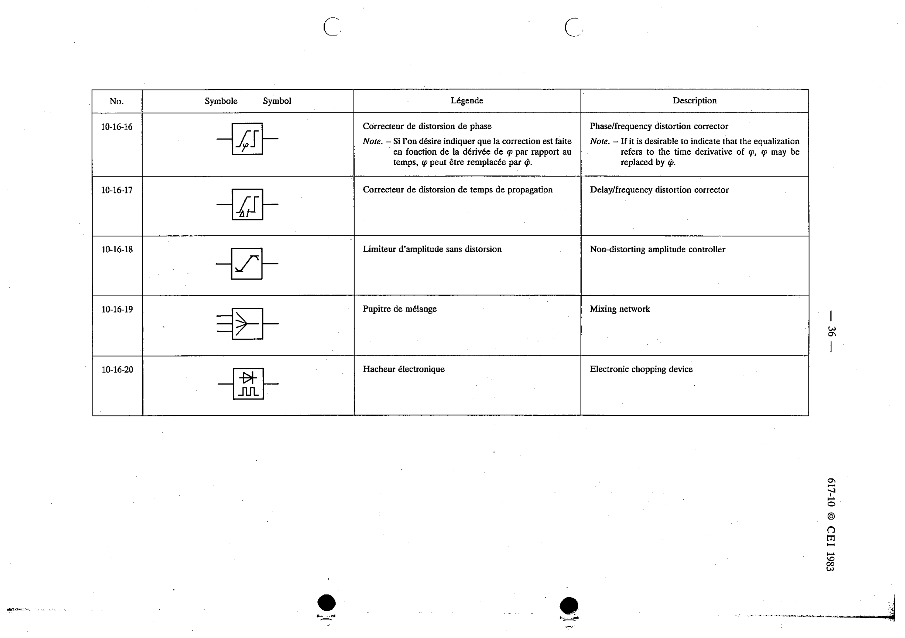

# 10-16-17 — Delay/frequency distortion corrector

This symbol appears on Publication No.617-10.pdf, printed p.36 (full page shown).

**Standard:** [[60617-10]] · **Section:** [[60617-10-16-networks-with-several-pairs]]

## Description
Delay/frequency distortion corrector.

## Names
- **EN:** Delay/frequency distortion corrector
- **FR:** Correcteur de distorsion de temps de propagation

