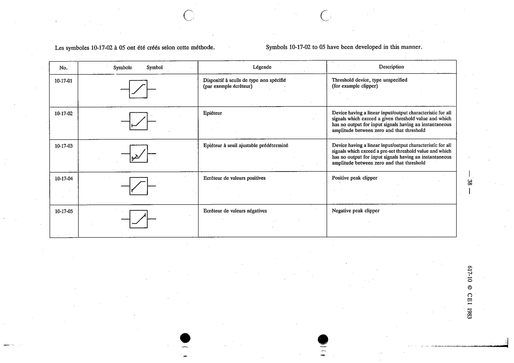

# 10-17-03 — Limiter with pre-set adjustable threshold

This symbol appears on Publication No.617-10.pdf, printed p.38 (full page shown).

**Standard:** [[60617-10]] · **Section:** [[60617-10-17-threshold-devices]]

## Description
Device having a linear input/output characteristic for all signals which exceed a pre-set threshold value and which has no output for input signals having an instantaneous amplitude between zero and that threshold.

## Names
- **EN:** Limiter with pre-set adjustable threshold
- **FR:** Épiéteur à seuil ajustable prédéterminé

