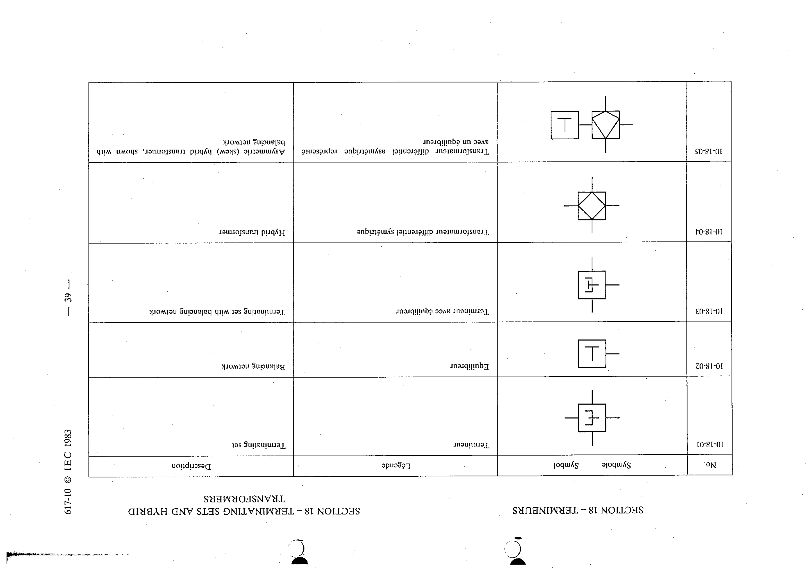

# 10-18-05 — Asymmetric (skew) hybrid transformer, shown with balancing network

This symbol appears on Publication No.617-10.pdf, printed p.39 (full page shown).

**Standard:** [[60617-10]] · **Section:** [[60617-10-18-terminating-sets-and-hybrid]]

## Description
Asymmetric (skew) hybrid transformer, shown with balancing network.

## Names
- **EN:** Asymmetric (skew) hybrid transformer, shown with balancing network
- **FR:** Transformateur différentiel asymétrique représenté avec un équilibreur

