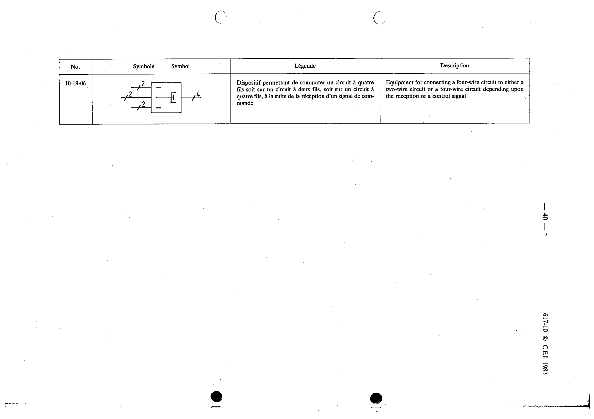

# 10-18-06 — Equipment for connecting a four-wire circuit to either a two-wire or four-wire circuit

This symbol appears on Publication No.617-10.pdf, printed p.40 (full page shown).

**Standard:** [[60617-10]] · **Section:** [[60617-10-18-terminating-sets-and-hybrid]]

## Description
Equipment for connecting a four-wire circuit to either a two-wire circuit or a four-wire circuit depending upon the reception of a control signal.

## Names
- **EN:** Equipment for connecting a four-wire circuit to either a two-wire or four-wire circuit
- **FR:** Dispositif permettant de commuter un circuit à quatre fils soit sur un circuit à deux fils, soit sur un circuit à quatre fils, à la suite de la réception d'un signal de commande

