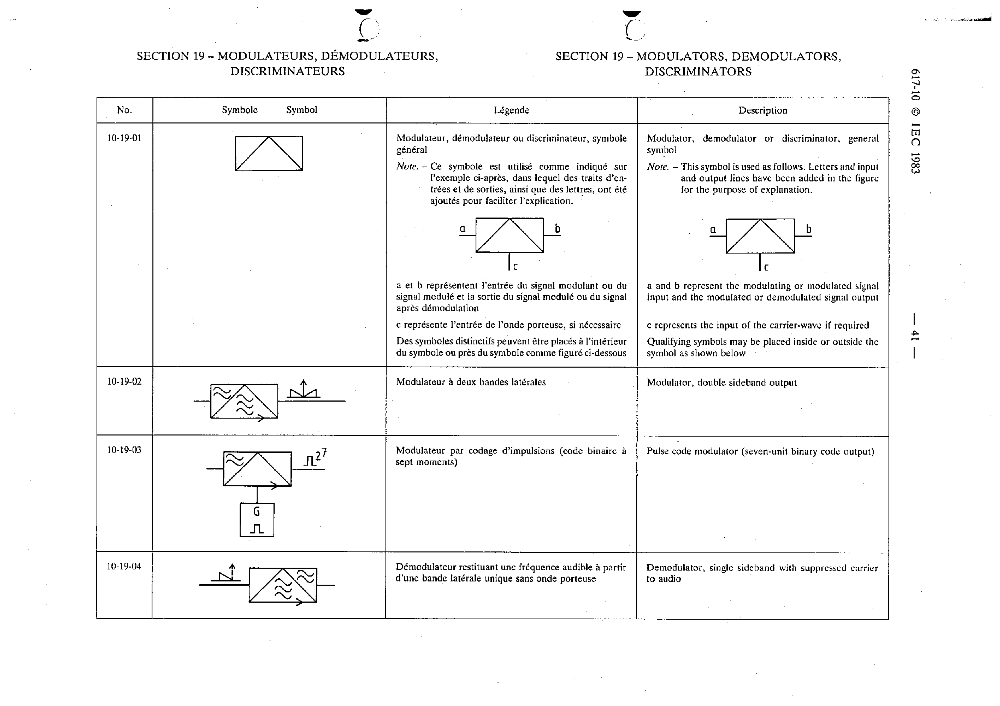

# 10-19-04 — Demodulator, single sideband with suppressed carrier to audio

This symbol appears on Publication No.617-10.pdf, printed p.41 (full page shown).

**Standard:** [[60617-10]] · **Section:** [[60617-10-19-modulators-demodulators-discriminators]]

## Description
Demodulator, single sideband with suppressed carrier to audio.

## Names
- **EN:** Demodulator, single sideband with suppressed carrier to audio
- **FR:** Démodulateur restituant une fréquence audible à partir d'une bande latérale unique sans onde porteuse

