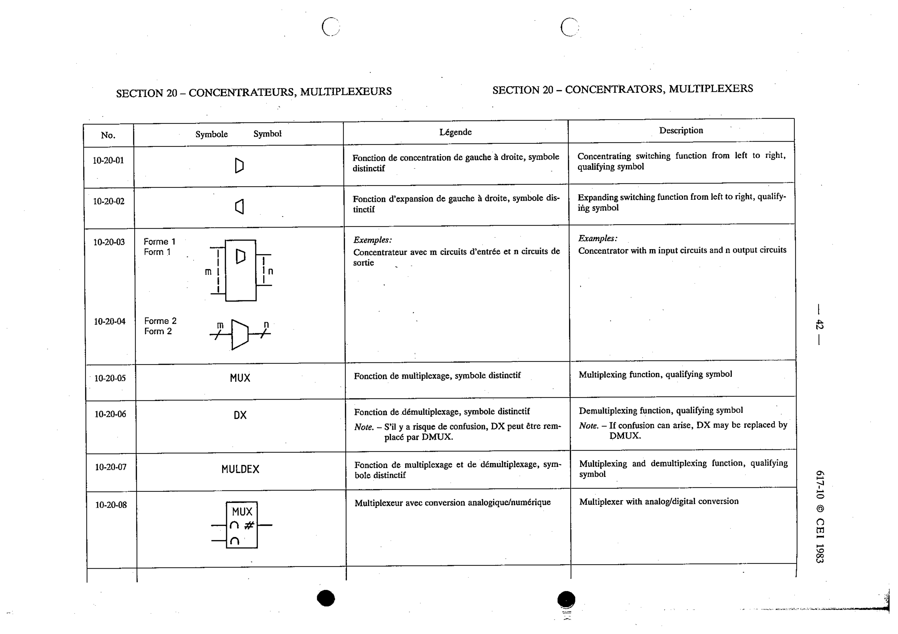

# 10-20-02 — Expanding switching function from left to right, qualifying symbol

This symbol appears on Publication No.617-10.pdf, printed p.42 (full page shown).

**Standard:** [[60617-10]] · **Section:** [[60617-10-20-concentrators-multiplexers]]

## Description
Expanding switching function from left to right, qualifying symbol.

## Names
- **EN:** Expanding switching function from left to right, qualifying symbol
- **FR:** Fonction d'expansion de gauche à droite, symbole distinctif

