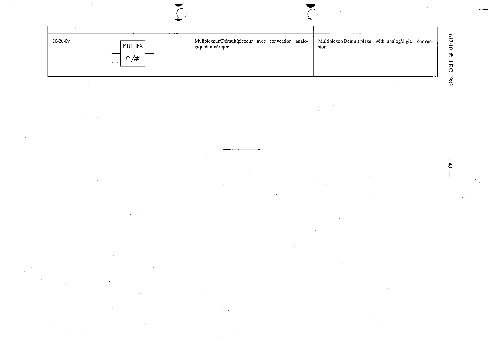

# 10-20-09 — Multiplexer/Demultiplexer with analog/digital conversion

This symbol appears on Publication No.617-10.pdf, printed p.43 (full page shown).

**Standard:** [[60617-10]] · **Section:** [[60617-10-20-concentrators-multiplexers]]

## Description
Multiplexer/Demultiplexer with analog/digital conversion.

## Names
- **EN:** Multiplexer/Demultiplexer with analog/digital conversion
- **FR:** Multiplexeur/Démultiplexeur avec conversion analogique/numérique

