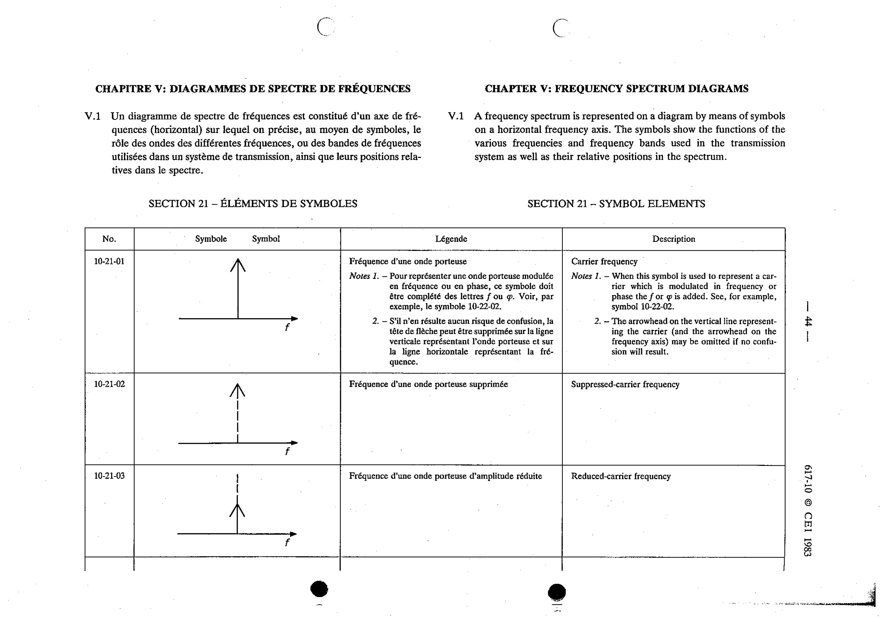

# 10-21-02 — Suppressed-carrier frequency

This symbol appears on Publication No.617-10.pdf, printed p.44 (full page shown).

**Standard:** [[60617-10]] · **Section:** [[60617-10-21-symbol-elements]]

## Description
Suppressed-carrier frequency.

## Names
- **EN:** Suppressed-carrier frequency
- **FR:** Fréquence d'une onde porteuse supprimée

