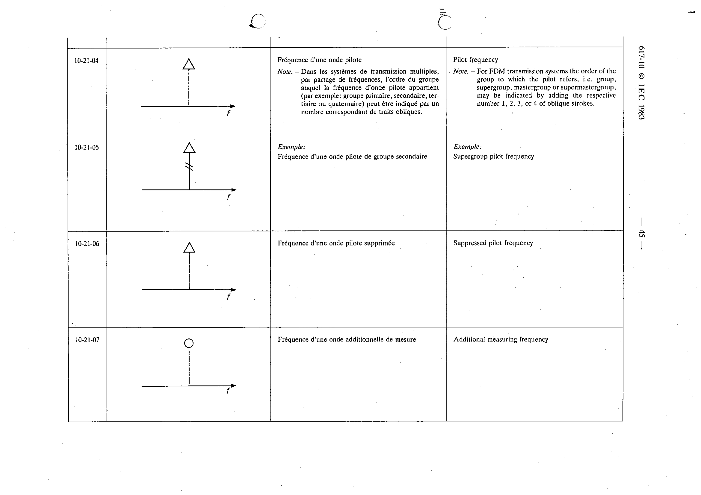

# 10-21-05 — Supergroup pilot frequency

This symbol appears on Publication No.617-10.pdf, printed p.45 (full page shown).

**Standard:** [[60617-10]] · **Section:** [[60617-10-21-symbol-elements]]

## Description
Supergroup pilot frequency.

## Names
- **EN:** Supergroup pilot frequency
- **FR:** Fréquence d'une onde pilote de groupe secondaire

