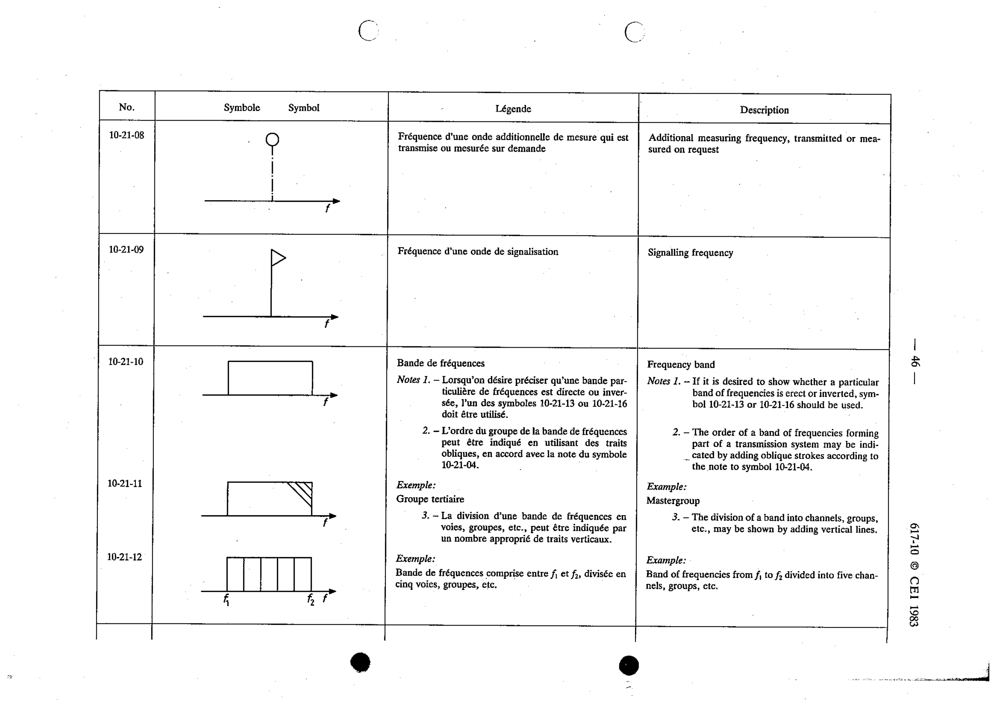

# 10-21-10 — Frequency band

This symbol appears on Publication No.617-10.pdf, printed p.46 (full page shown).

**Standard:** [[60617-10]] · **Section:** [[60617-10-21-symbol-elements]]

## Description
Frequency band. Note 1 - If it is desired to show whether a particular band of frequencies is erect or inverted, symbol 10-21-13 or 10-21-16 should be used. Note 2 - The order of a band of frequencies forming part of a transmission system may be indicated by adding oblique strokes according to the note to symbol 10-21-04.

## Names
- **EN:** Frequency band
- **FR:** Bande de fréquences

## Notes
- If it is desired to show whether a particular band of frequencies is erect or inverted, symbol 10-21-13 or 10-21-16 should be used.
- The order of a band of frequencies forming part of a transmission system may be indicated by adding oblique strokes according to the note to symbol 10-21-04.

## Related
- [[10-21-13]]
- [[10-21-16]]
- [[10-21-04]]
