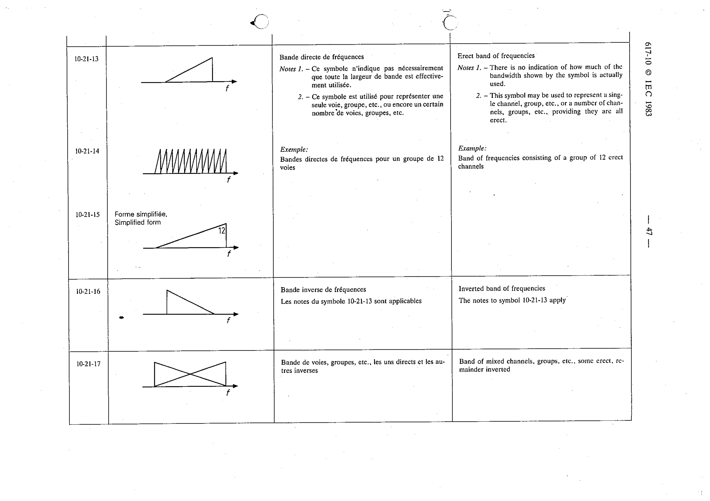

# 10-21-13 — Erect band of frequencies

This symbol appears on Publication No.617-10.pdf, printed p.47 (full page shown).

**Standard:** [[60617-10]] · **Section:** [[60617-10-21-symbol-elements]]

## Description
Erect band of frequencies. Note 1 - There is no indication of how much of the bandwidth shown by the symbol is actually used. Note 2 - This symbol may be used to represent a single channel, group, etc., or a number of channels, groups, etc., providing they are all erect.

## Names
- **EN:** Erect band of frequencies
- **FR:** Bande directe de fréquences

## Notes
- There is no indication of how much of the bandwidth shown by the symbol is actually used.
- This symbol may be used to represent a single channel, group, etc., or a number of channels, groups, etc., providing they are all erect.

