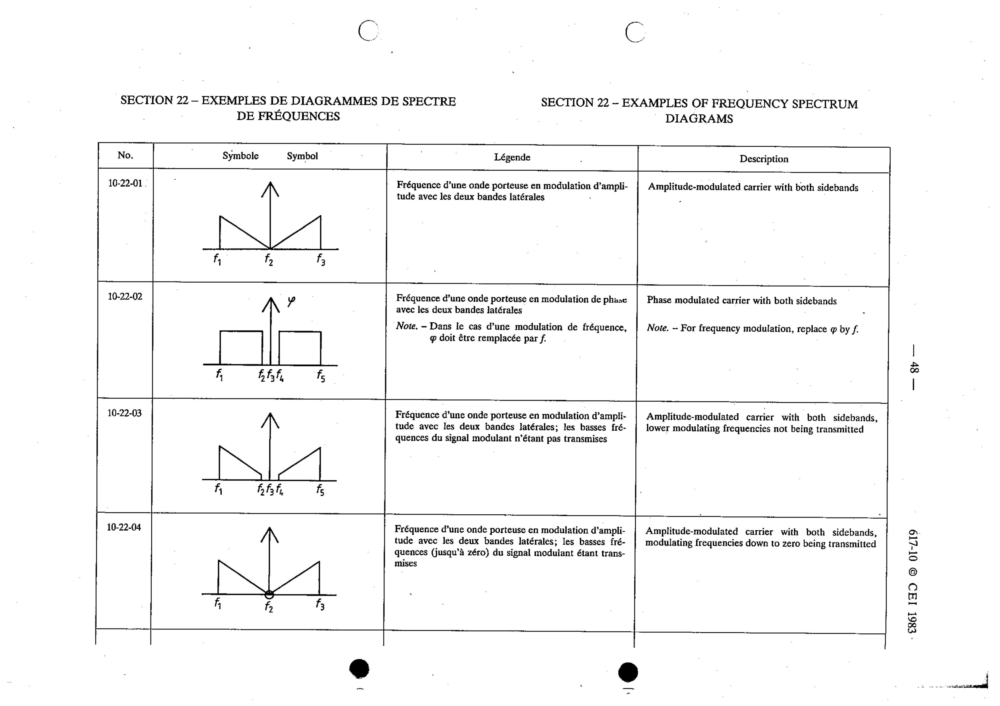

# 10-22-02 — Phase modulated carrier with both sidebands

This symbol appears on Publication No.617-10.pdf, printed p.48 (full page shown).

**Standard:** [[60617-10]] · **Section:** [[60617-10-22-examples-of-frequency-spectrum]]

## Description
Phase modulated carrier with both sidebands. Note - For frequency modulation, replace φ by f.

## Names
- **EN:** Phase modulated carrier with both sidebands
- **FR:** Fréquence d'une onde porteuse à modulation de phase avec les deux bandes latérales

## Notes
- For frequency modulation, replace φ by f.

