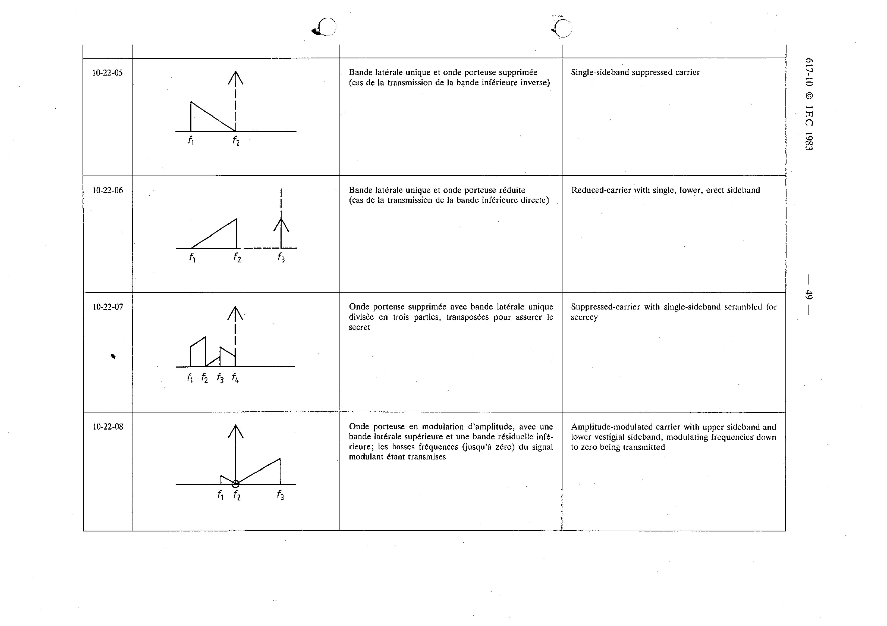

# 10-22-08 — Amplitude-modulated carrier with upper sideband and lower vestigial sideband

This symbol appears on Publication No.617-10.pdf, printed p.49 (full page shown).

**Standard:** [[60617-10]] · **Section:** [[60617-10-22-examples-of-frequency-spectrum]]

## Description
Amplitude-modulated carrier with upper sideband and lower vestigial sideband, modulating frequencies down to zero being transmitted.

## Names
- **EN:** Amplitude-modulated carrier with upper sideband and lower vestigial sideband
- **FR:** Onde porteuse en modulation d'amplitude, avec une bande latérale supérieure et une bande résiduelle inférieure; les basses fréquences (jusqu'à zéro) du signal modulant étant transmises

