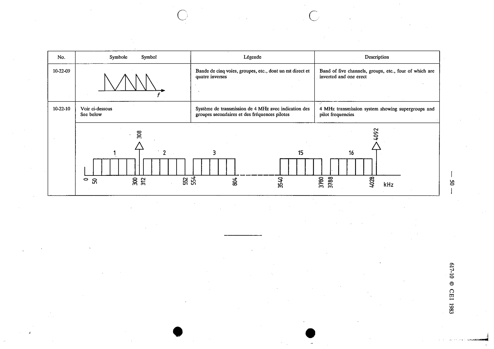

# 10-22-10 — 4 MHz transmission system showing supergroups and pilot frequencies

This symbol appears on Publication No.617-10.pdf, printed p.50 (full page shown).

**Standard:** [[60617-10]] · **Section:** [[60617-10-22-examples-of-frequency-spectrum]]

## Description
4 MHz transmission system showing supergroups and pilot frequencies (see below).

## Names
- **EN:** 4 MHz transmission system showing supergroups and pilot frequencies
- **FR:** Système de transmission de 4 MHz avec indication des groupes secondaires et des fréquences pilotes (voir ci-dessous)

