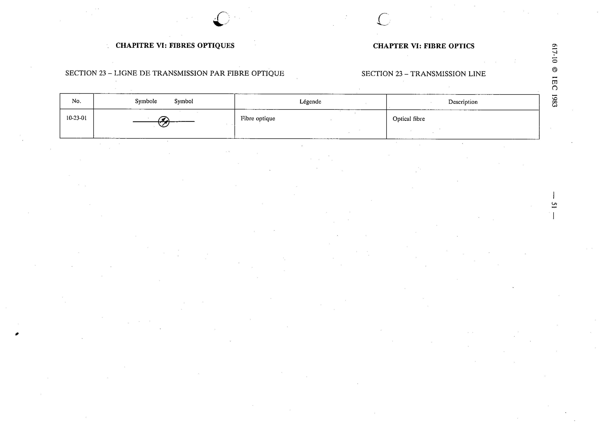

# 10-23-01 — Optical fibre

This symbol appears on Publication No.617-10.pdf, printed p.51 (full page shown).

**Standard:** [[60617-10]] · **Section:** [[60617-10-23-transmission-line]]

## Description
Optical fibre.

## Names
- **EN:** Optical fibre
- **FR:** Fibre optique

