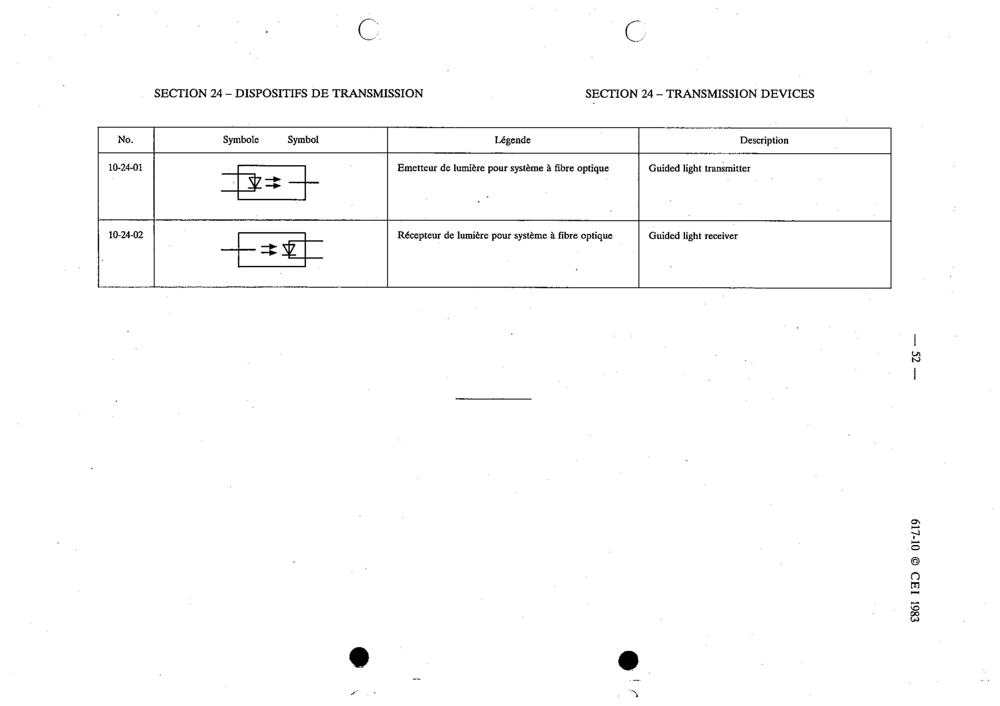

# 10-24-02 — Guided light receiver

This symbol appears on Publication No.617-10.pdf, printed p.52 (full page shown).

**Standard:** [[60617-10]] · **Section:** [[60617-10-24-transmission-devices]]

## Description
Guided light receiver (light receiver for optical fibre system).

## Names
- **EN:** Guided light receiver
- **FR:** Récepteur de lumière pour système à fibre optique

