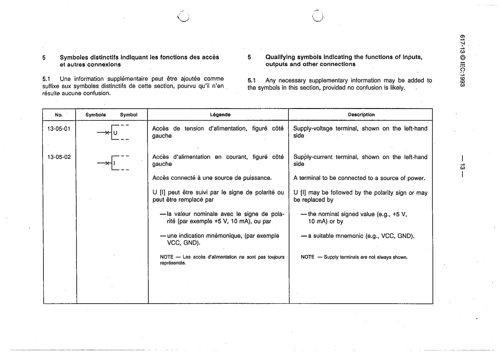

# 13-05-01 — Supply-voltage terminal, shown on the left-hand side

This symbol appears on Publication No.617-13.pdf, printed p.13 (full page shown).

**Standard:** [[60617-13]] · **Section:** [[60617-13-05-qualifying-symbols-indicating-the]]

## Description
Supply-voltage terminal, shown on the left-hand side. U may be followed by the polarity sign or replaced by the nominal signed value (e.g. +5 V) or a suitable mnemonic (e.g. VCC, GND).

## Names
- **EN:** Supply-voltage terminal, shown on the left-hand side
- **FR:** Accès de tension d'alimentation, figuré côté gauche

## Notes
- Supply terminals are not always shown.

