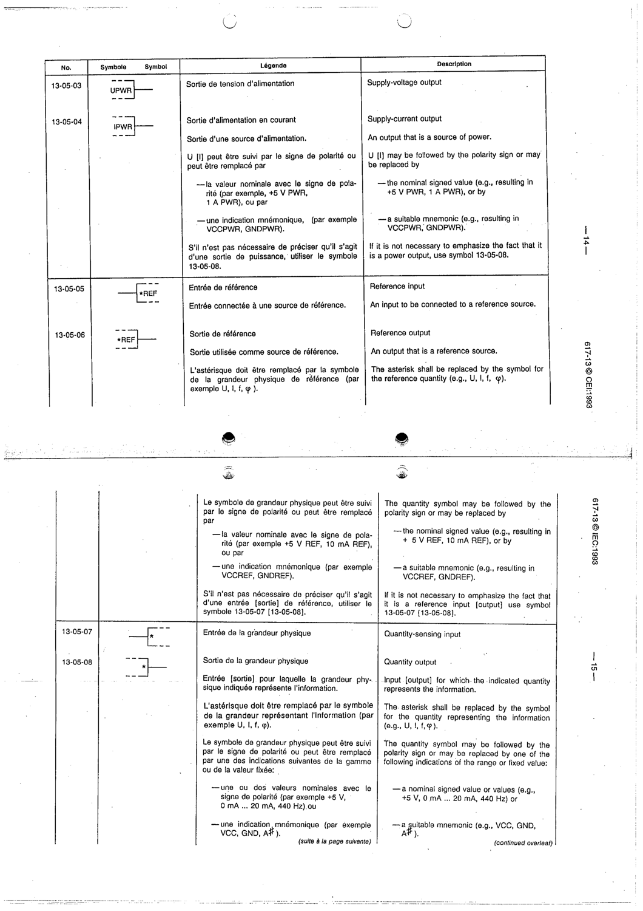

# 13-05-04 — Supply-current output

This symbol appears on Publication No.617-13.pdf, printed p.14 (full page shown).

**Standard:** [[60617-13]] · **Section:** [[60617-13-05-qualifying-symbols-indicating-the]]

## Description
Supply-current output: an output that is a source of power. If it is not necessary to emphasize that it is a power output, use symbol 13-05-08.

## Names
- **EN:** Supply-current output
- **FR:** Sortie d'alimentation en courant

## Related
- [[13-05-08]]
