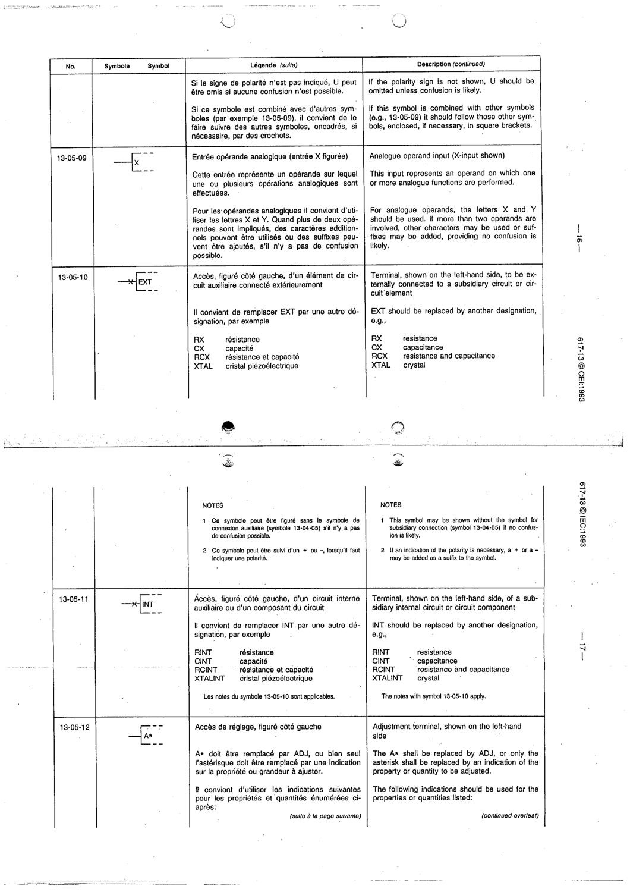

# 13-05-10 — Terminal (left side) to be externally connected to a subsidiary circuit or circuit element

This symbol appears on Publication No.617-13.pdf, printed p.16 (full page shown).

**Standard:** [[60617-13]] · **Section:** [[60617-13-05-qualifying-symbols-indicating-the]]

## Description
Terminal to be externally connected to a subsidiary circuit or element (symbol contains EXT; replace by e.g. RX, CX, RCX, XTAL).

## Names
- **EN:** Terminal (left side) to be externally connected to a subsidiary circuit or circuit element
- **FR:** Accès, figuré côté gauche, d'un élément du circuit auxiliaire connecté extérieurement

