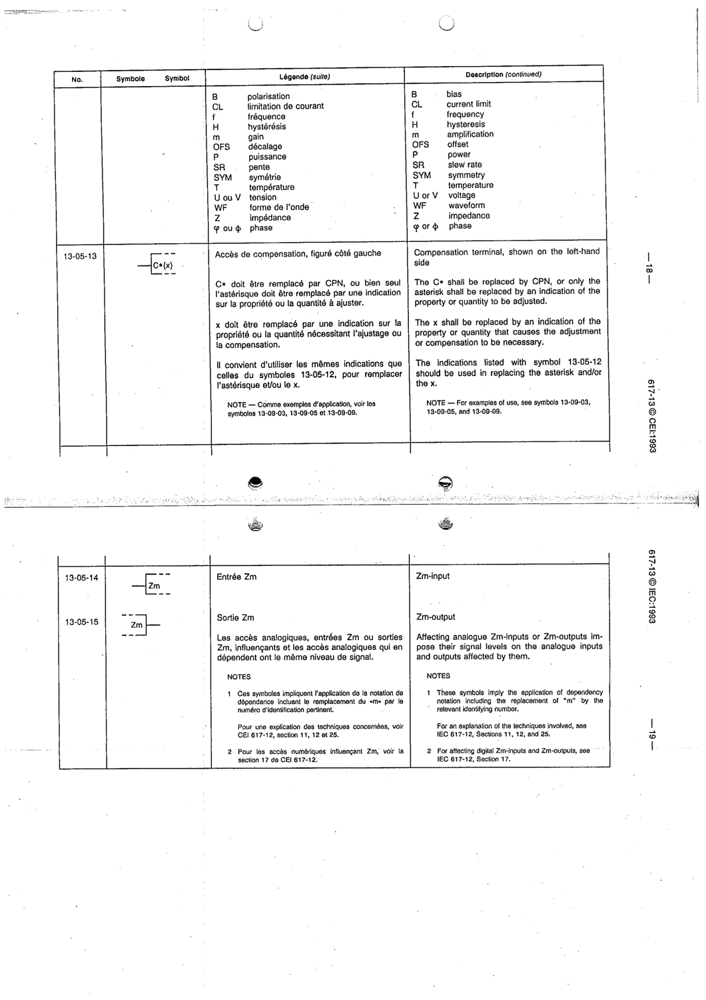

# 13-05-13 — Compensation terminal, shown on the left-hand side

This symbol appears on Publication No.617-13.pdf, printed p.18 (full page shown).

**Standard:** [[60617-13]] · **Section:** [[60617-13-05-qualifying-symbols-indicating-the]]

## Description
Compensation terminal C*(x). C* → CPN or a property indication; x → the property/quantity causing the compensation.

## Names
- **EN:** Compensation terminal, shown on the left-hand side
- **FR:** Accès de compensation, figuré côté gauche

## Notes
- For examples of use, see 13-09-03, 13-05-05 and 13-09-09.

## Related
- [[13-05-12]]
- [[13-09-03]]
- [[13-09-09]]
