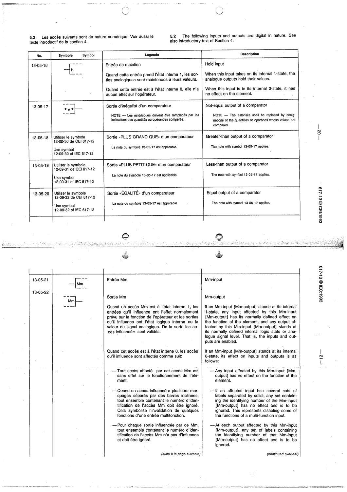

# 13-05-17 — Not-equal output of a comparator

This symbol appears on Publication No.617-13.pdf, printed p.20 (full page shown).

**Standard:** [[60617-13]] · **Section:** [[60617-13-05-qualifying-symbols-indicating-the]]

## Description
Not-equal output of a comparator.

## Names
- **EN:** Not-equal output of a comparator
- **FR:** Sortie d'inégalité d'un comparateur

## Notes
- The asterisks shall be replaced by designations of the quantities or operands compared.

