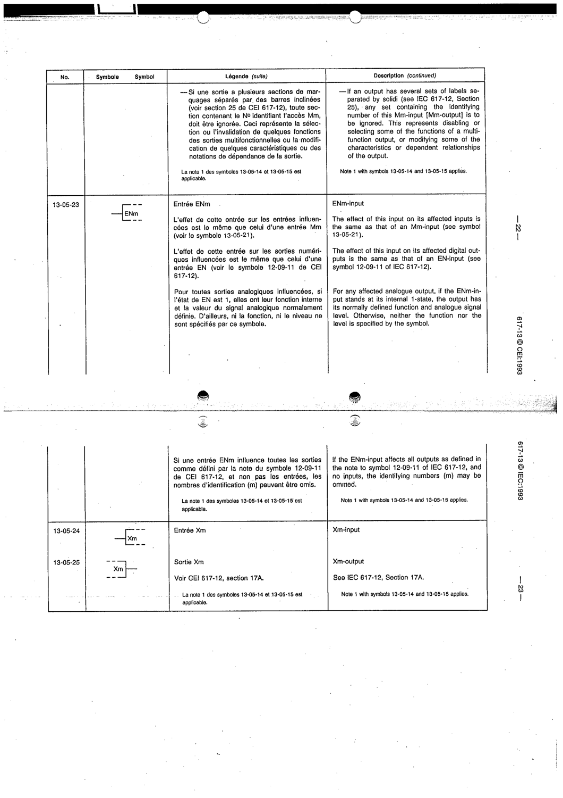

# 13-05-23 — ENm-input

This symbol appears on Publication No.617-13.pdf, printed p.22 (full page shown).

**Standard:** [[60617-13]] · **Section:** [[60617-13-05-qualifying-symbols-indicating-the]]

## Description
Effect on affected inputs is the same as an Mm-input (13-05-21); on digital outputs the same as an EN-input (12-09-11 of IEC 617-12); for analogue outputs, the output has its normal function/level only when ENm is at internal 1-state.

## Names
- **EN:** ENm-input
- **FR:** Entrée ENm

## Notes
- Note 1 with symbols 13-05-14 and 13-05-15 applies.

## Related
- [[13-05-21]]
- [[12-09-11]]
- [[60617-12]]
- [[13-05-14]]
- [[13-05-15]]
