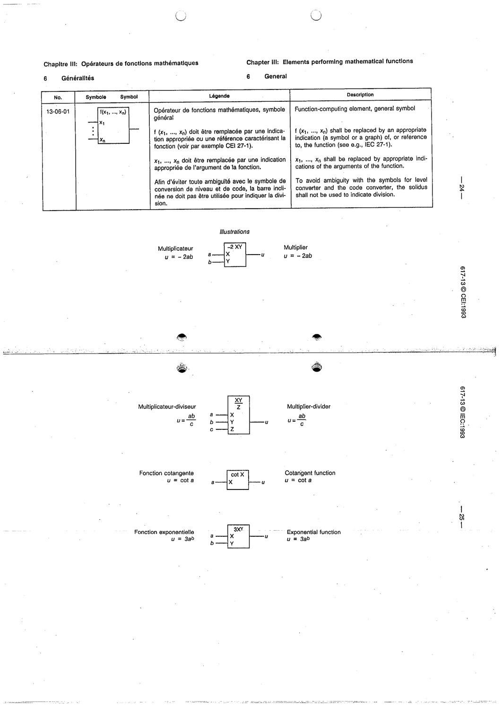

# 13-06-01 — Function-computing element, general symbol

This symbol appears on Publication No.617-13.pdf, printed p.24 (full page shown).

**Standard:** [[60617-13]] · **Section:** [[60617-13-06-elements-performing-mathematical-functions]]

## Description
Function-computing element. Replace f(x1,...,xb) by an indication of/reference to the function (e.g. IEC 27-1) and the arguments. The solidus shall not be used to indicate division. Illustrations: multiplier, multiplier-divider, cotangent, exponential.

## Names
- **EN:** Function-computing element, general symbol
- **FR:** Opérateur de fonctions mathématiques, symbole général

## Related
- **IEC 27-1**
