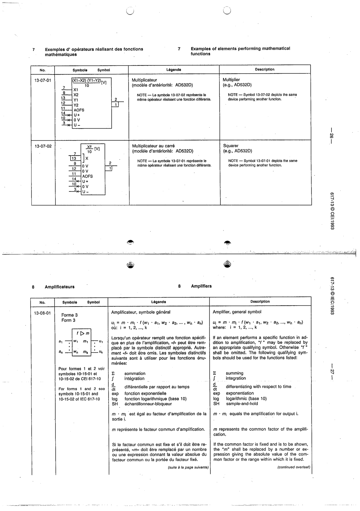

# 13-07-01 — Multiplier (e.g. AD532D)

This symbol appears on Publication No.617-13.pdf, printed p.26 (full page shown).

**Standard:** [[60617-13]] · **Section:** [[60617-13-07-examples-of-elements-performing]]

## Description
Example: multiplier (X1−X2)(Y1−Y2)/10 [V], device AD532D.

## Names
- **EN:** Multiplier (e.g. AD532D)
- **FR:** Multiplicateur (par exemple AD532D)

## Notes
- Symbol 13-07-02 depicts the same device performing another function.

## Related
- [[13-07-02]]
