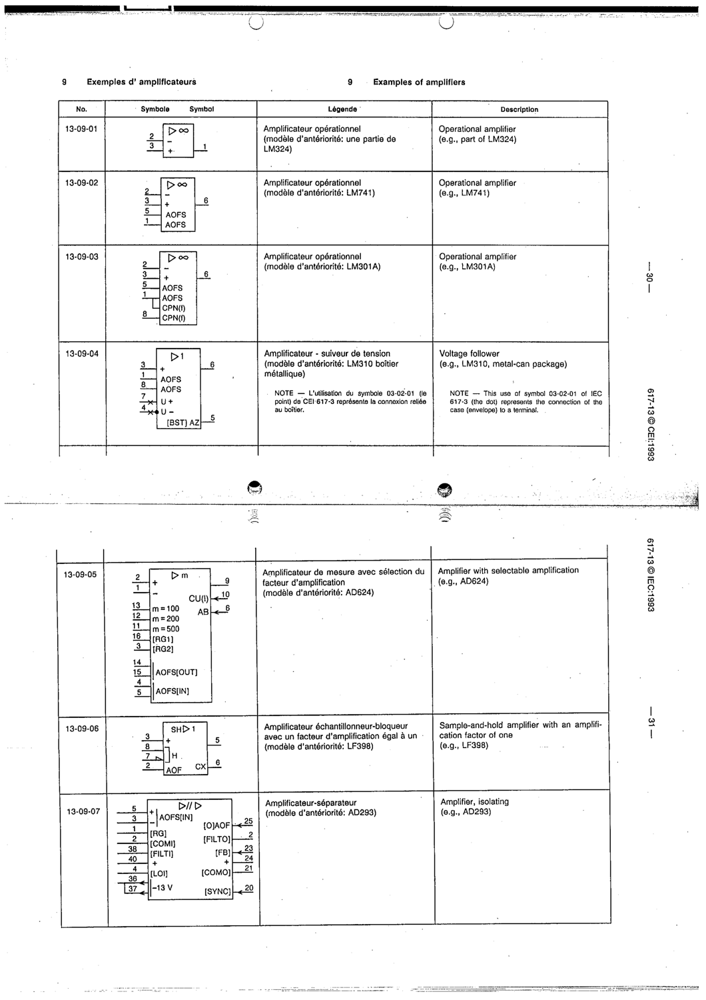

# 13-09-05 — Amplifier with selectable amplification (e.g. AD624)

This symbol appears on Publication No.617-13.pdf, printed p.31 (full page shown).

**Standard:** [[60617-13]] · **Section:** [[60617-13-09-examples-of-amplifiers]]

## Description
Example: instrumentation amplifier with selectable gain (m=100/200/500), device AD624.

## Names
- **EN:** Amplifier with selectable amplification (e.g. AD624)
- **FR:** Amplificateur de mesure avec sélection du facteur d'amplification (par exemple AD624)

## Related
- **AD624**
