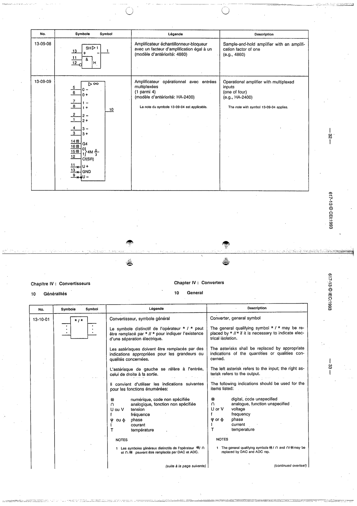

# 13-10-01 — Converter, general symbol

This symbol appears on Publication No.617-13.pdf, printed p.33 (full page shown).

**Standard:** [[60617-13]] · **Section:** [[60617-13-10-converters-general]]

## Description
Converter general symbol. The qualifying symbol */* may be replaced by * // * to indicate electrical isolation. Asterisks: left=input, right=output. Indications: # digital, ∩ analogue, U/V voltage, f frequency, φ phase, I current, T temperature.

## Names
- **EN:** Converter, general symbol
- **FR:** Convertisseur, symbole général

## Notes
- The general qualifying symbols #/∩ and ∩/# may be replaced by DAC and ADC respectively.

