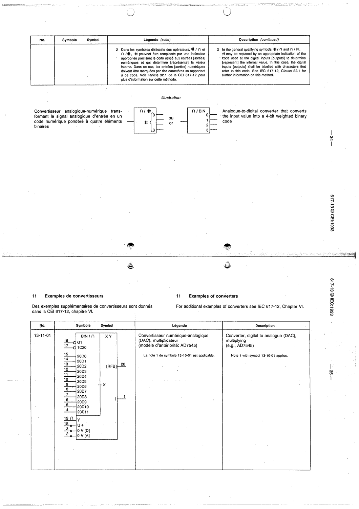

# 13-11-01 — Multiplying digital-to-analogue converter (DAC) (e.g. AD7545)

This symbol appears on Publication No.617-13.pdf, printed p.35 (full page shown).

**Standard:** [[60617-13]] · **Section:** [[60617-13-11-examples-of-converters]]

## Description
Example: multiplying DAC (BIN/∩), device AD7545.

## Names
- **EN:** Multiplying digital-to-analogue converter (DAC) (e.g. AD7545)
- **FR:** Convertisseur numérique-analogique multiplicateur (par exemple AD7545)

## Notes
- Note 1 with symbol 13-10-01 applies.

## Related
- **AD7545**
- [[13-10-01]]
