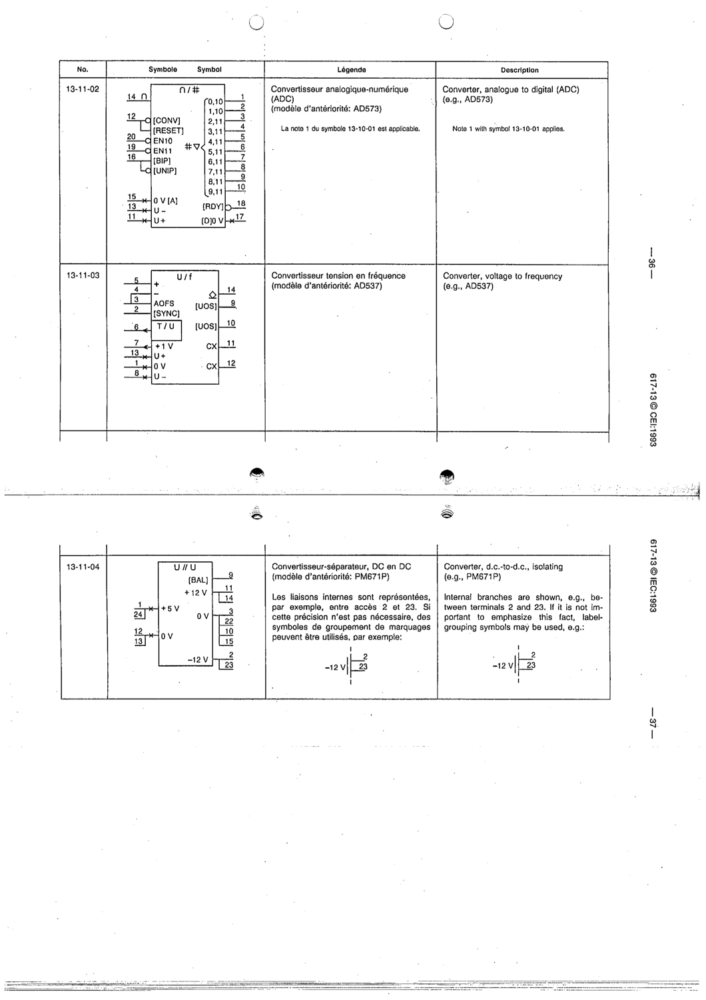

# 13-11-02 — Analogue-to-digital converter (ADC) (e.g. AD673)

This symbol appears on Publication No.617-13.pdf, printed p.36 (full page shown).

**Standard:** [[60617-13]] · **Section:** [[60617-13-11-examples-of-converters]]

## Description
Example: ADC (∩/BIN), device AD673.

## Names
- **EN:** Analogue-to-digital converter (ADC) (e.g. AD673)
- **FR:** Convertisseur analogique-numérique (par exemple AD673)

## Notes
- Note 1 with symbol 13-10-01 applies.

## Related
- **AD673**
- [[13-10-01]]
