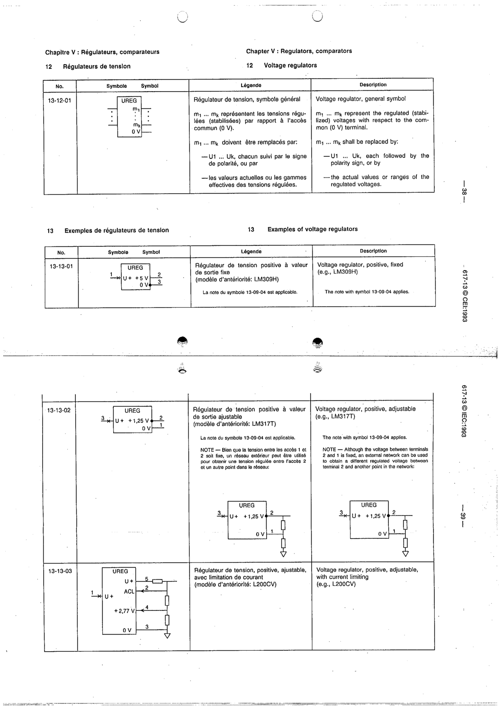

# 13-13-02 — Voltage regulator, positive, adjustable (e.g. LM317T)

This symbol appears on Publication No.617-13.pdf, printed p.39 (full page shown).

**Standard:** [[60617-13]] · **Section:** [[60617-13-13-examples-of-voltage-regulators]]

## Description
Example: positive adjustable voltage regulator (UREG, +1.25 V), device LM317T.

## Names
- **EN:** Voltage regulator, positive, adjustable (e.g. LM317T)
- **FR:** Régulateur de tension positive ajustable (par exemple LM317T)

## Notes
- The note with symbol 13-09-04 applies.
- Although the voltage between terminals 2 and 1 is fixed, an external network can give a different regulated voltage.

## Related
- **LM317T**
- [[13-09-04]]
