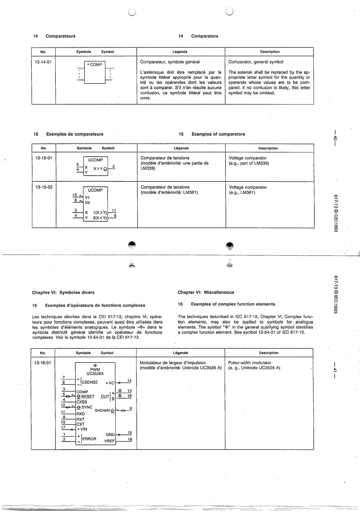

# 13-14-01 — Comparator, general symbol

This symbol appears on Publication No.617-13.pdf, printed p.40 (full page shown).

**Standard:** [[60617-13]] · **Section:** [[60617-13-14-comparators]]

## Description
Comparator general symbol (*COMP*). The asterisk is the letter symbol for the quantity compared; may be omitted if no confusion.

## Names
- **EN:** Comparator, general symbol
- **FR:** Comparateur, symbole général

